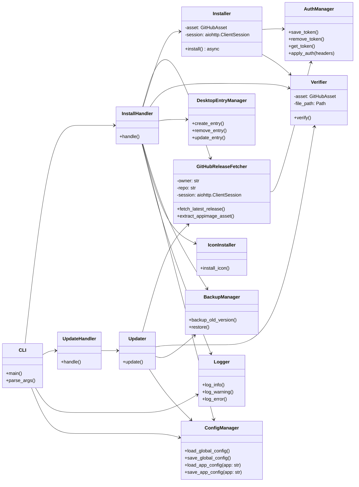
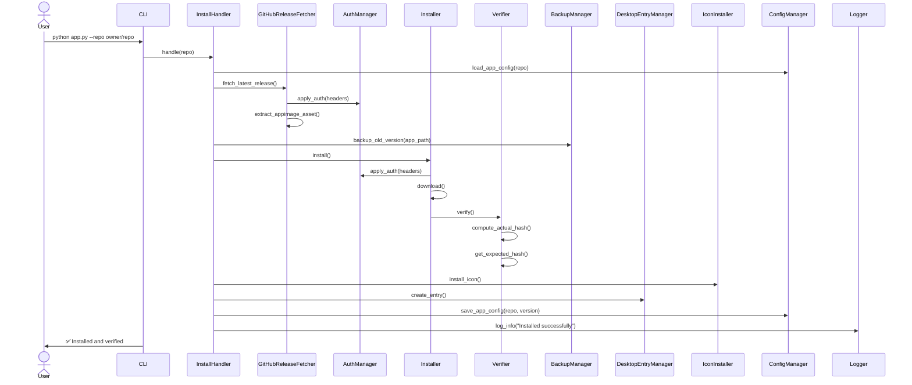

# Appimage installer and updater package management cli script

## Basic summary of the script

Install the appimage from the github api. Similar to package managements
but focused on appimages.

## Features wanted:

- Install
    - with github url to repo
    - with catalog from the our stored data(json)
- Update
    - with app base saved stored data(json)
    - with catalog from the our stored data(json)
- Icon install
    - with catalog from the our stored data(json)
- Config management
    - global for the settings like concurrent limit, i18n etc.
    - app specific for the settings like version, appimage name
- Progress bar
    - tqdm.asyncio progress bar to display the download progress
- Logging Management
    - Logging the script execution
    - Logging the script errors
    - Logging the script warnings
    - Logging the script info
- Backup Management
    - Backup the old appimage to a specific directory
    - Restore the old appimage from a specific directory
- Auth Management
    - saving, removing, loading auth token to use for api requests
    - rate limit management
- Desktop entry creation, update, uninstall
- File Management
    - moving appimages to a specific directory
    - making executable
- Verification
    - digest(github api provide)
    - Checksum file verification
        - sha512: latest-linux.yml
        - sha256: SHA256SUMS.txt, <appimage_name>.sha256sum etc.
- Python package management
    - Installing as a python package via .venv
    - Updating the script
    - Uninstalling the script

## Architecture

### Language & other features

- Python 3.12+
- Concurrent update support for catalog and update
    - We need for icon installation too
- Prerelease support for beta releases
- Without verification support which some apps developers don't provide it
- Basic cache support for auth management
    - cache the rate limit from last request
        - 5000 rate limit in 1 hour
        - 100 concurrent rate limit
- Use pytest with mocks for network/IO
- Update notification support for desktop notifications

### Design Patterns

Factory To create fetchers or verifiers dynamically (GitHub vs catalog, SHA256 vs SHA512)
Strategy For flexible digest or checksum verification methods
Command CLI subcommands as invocable actions
Adapter Normalize GitHub API vs catalog data to a unified format
Singleton Global config or logger setup
Observer (Optional) For event hooks (e.g., notify on install completion)
Dependency Injection (DI) For testability (inject session, logger, etc.)

### Diagram

